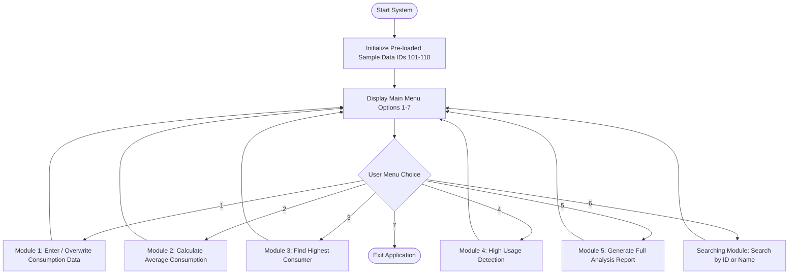

# FINAL PROJECT REPORT
## Case Study 184: Electricity Consumption Analyzer

**Course**: Java Programming Final Project  
**Author**: Student  
**System Name**: Electricity Consumption Analyzer  
**Implementation**: Beginner / Intermediate Java  
**Source Code**: [`ElectricityConsumptionAnalyzer.java`](file:///Users/aditya/Major_2nd(1st_unit)/JAVA/ElectricityConsumptionAnalyzer.java)  

---

## 1. Executive Summary & Project Overview

The **Electricity Consumption Analyzer** is a console-based software system developed for utility companies to monitor, evaluate, and report monthly electrical energy consumption across customer accounts. The application processes consumption records in kilowatt-hours (kWh), calculates key statistical metrics (such as total and average usage), identifies peak energy consumers, alerts administrators about high-consumption accounts using custom benchmarks, and provides instant record lookup functionality.

Built with fundamental Java programming constructs, the system highlights clean modular design using one-dimensional (1D) arrays, method decomposition, control flow loops, conditional logic, input validation, and linear searching.

---

## 2. Objectives & Problem Statement

### 2.1 Problem Statement
Utility management requires a reliable and lightweight tool to maintain customer monthly consumption records, detect abnormal or excessive power usage patterns, calculate financial/energy averages, and locate individual subscriber data efficiently without complex external database dependencies.

### 2.2 Core Objectives
1. **Store Monthly Consumption**: Maintain parallel 1D arrays for Customer IDs, Customer Names, and Monthly kWh Consumption.
2. **Calculate Average Usage**: Compute the cumulative total usage and arithmetic mean across all customer accounts.
3. **Identify Peak Consumer**: Locate and display the customer account with the maximum electricity usage.
4. **Detect High Usage Accounts**: Filter and report customer accounts exceeding a specified high-consumption benchmark using `if-else` statements.
5. **Generate Comprehensive Reports**: Render a formatted analysis report combining tabular record listings and aggregate summary metrics.
6. **Search Customer Records**: Allow linear searching by Customer ID or Customer Name.

---

## 3. System Architecture & Technical Specifications

### 3.1 Technology Stack
- **Programming Language**: Java (JDK 8+)
- **User Interface**: Command-Line Interface (CLI) with interactive menu
- **Input Mechanism**: `java.util.Scanner`
- **Data Structures**: Parallel 1D Primitive & Reference Arrays (`int[]`, `String[]`, `double[]`)

### 3.2 System Flowchart & Menu Architecture



---

## 4. Key Modules & Implementation Details

### 4.1 Module 1: Consumption Entry (`enterConsumptionData`)
- **Purpose**: Accepts the number of customers and populates the parallel arrays.
- **Java Features**: `Scanner`, `for` loop, array allocation (`new double[count]`), input validation loop (`while(usage < 0)`).

### 4.2 Module 2: Average Calculation (`calculateAverage`)
- **Purpose**: Sums up all consumption entries and computes the arithmetic mean.
- **Java Features**: Accumulator pattern (`totalSum = totalSum + consumption[i]`), arithmetic division operator (`/`).

### 4.3 Module 3: Highest Consumption (`findHighestConsumption`)
- **Purpose**: Traverses the array to track the maximum consumption value and corresponding customer index.
- **Java Features**: Comparison operator (`>`), index tracking (`maxIndex`).

### 4.4 Module 4: High Usage Detection (`identifyHighUsage`)
- **Purpose**: Evaluates each customer's monthly kWh usage against a customizable threshold (default: `500.0 kWh`).
- **Java Features**: Conditional branching (`if (consumption[i] >= threshold) ... else ...`), formatted output (`System.out.printf`).

### 4.5 Module 5: Analysis Report (`generateAnalysisReport`)
- **Purpose**: Synthesizes customer data into a clean administrative report with summary metrics.
- **Java Features**: Formatted tabular printing, total calculation, average calculation, peak lookup.

### 4.6 Search Module (`searchCustomer`)
- **Purpose**: Enables linear searching by Customer ID (`int`) or Customer Name (`String`).
- **Java Features**: String comparison (`equalsIgnoreCase`), linear search `for` loop, boolean flag `found`.

---

## 5. Sample Data Specification (IDs 101 – 110)

The system comes pre-initialized with 10 customer records to demonstrate full analytical capabilities immediately upon startup:

| Customer ID | Customer Name | Monthly Consumption (kWh) | Status (Threshold: 500.0 kWh) |
|:---:|:---|:---:|:---:|
| **101** | Alice Smith | 450.50 | Normal |
| **102** | Bob Jones | 680.00 | **HIGH USAGE** |
| **103** | Charlie Brown | 320.00 | Normal |
| **104** | Diana Prince | 890.25 | **HIGH USAGE** |
| **105** | Evan Wright | 510.00 | **HIGH USAGE** |
| **106** | Fiona Gallagher | 210.75 | Normal |
| **107** | George Clark | 750.50 | **HIGH USAGE** |
| **108** | Hannah Abbott | 430.00 | Normal |
| **109** | Ian Malcolm | 920.00 | **HIGH USAGE** *(Peak Consumer)* |
| **110** | Julia Roberts | 380.25 | Normal |

---

## 6. Screenshots & Visual Demonstrations

### 6.1 Main Menu & Initialization
![Main Menu Screen]

*Figure 6.1: Program Startup showing sample data initialization and main menu (Options 1–7).*

---

### 6.2 Electricity Analysis Report (Module 5)
![Analysis Report Screen]

*Figure 6.2: Module 5 Output showing tabular customer listing and summary metrics.*

---

### 6.3 High-Consumption Detection (Module 4)
![High Usage Detection Screen]

*Figure 6.3: Module 4 Output identifying customer accounts exceeding the 500.0 kWh threshold.*

---

## 7. Compilation & Execution Guide

### 7.1 Prerequisites
- Java Development Kit (JDK 8 or higher) installed on macOS / Windows / Linux.

### 7.2 Commands

1. **Navigate to project directory**:
   ```bash
   cd "/Users/aditya/Major_2nd(1st_unit)/JAVA"
   ```

2. **Compile Java Source Code**:
   ```bash
   javac ElectricityConsumptionAnalyzer.java
   ```

3. **Run Application**:
   ```bash
   java ElectricityConsumptionAnalyzer
   ```

---

## 8. Summary of Results & Conclusion

### 8.1 Aggregate Results for Sample Dataset (10 Customers)
- **Total Customers Processed**: 10
- **Cumulative Energy Consumed**: 5,542.25 kWh
- **Average Customer Usage**: 554.23 kWh
- **Peak Consumer**: Ian Malcolm (ID: 109) with **920.00 kWh**
- **High Consumption Accounts Flagged (≥ 500 kWh)**: 5 Accounts (IDs 102, 104, 105, 107, 109)

### 8.2 Learning Outcomes
This project successfully demonstrates the application of beginner to intermediate Java principles:
- Efficient memory allocation using **1D arrays**.
- Modular code architecture through **static methods**.
- Robust user interaction handling via **Scanner** and validation loops.
- Clear conditional logic implementation using **if-else statements**.
- Elementary search implementation via **linear array scanning**.
